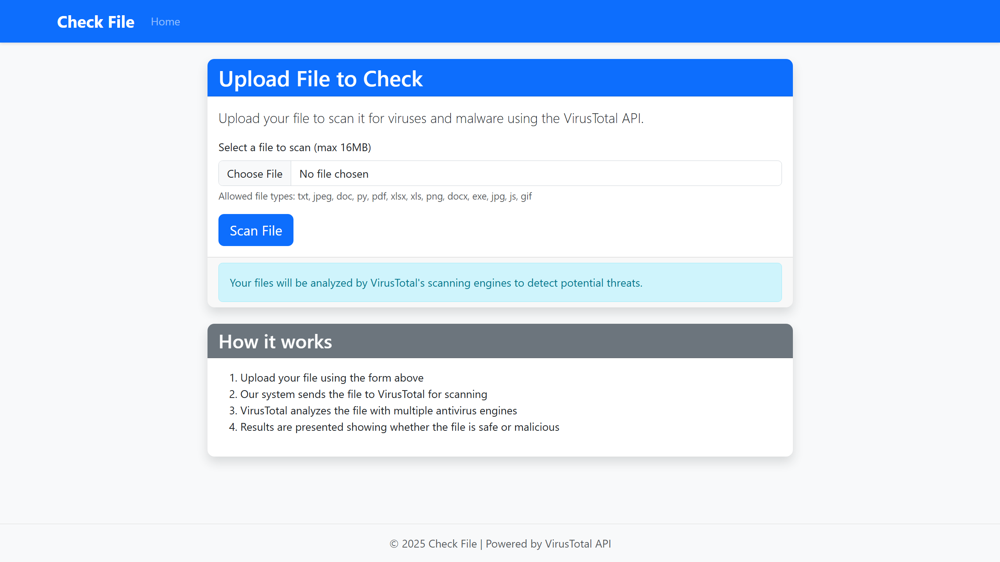
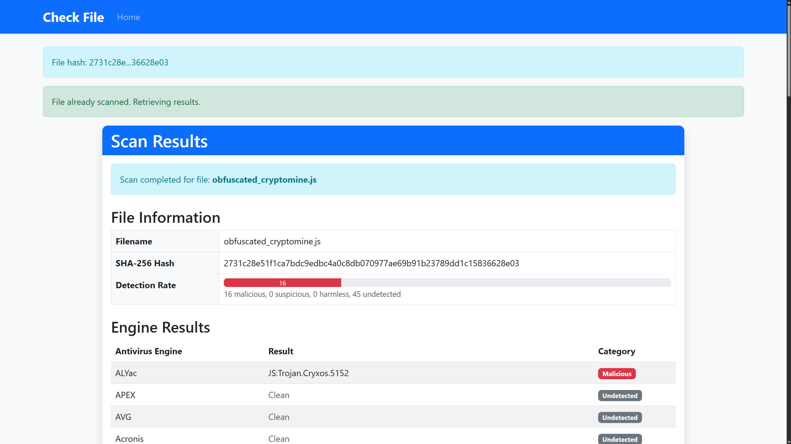
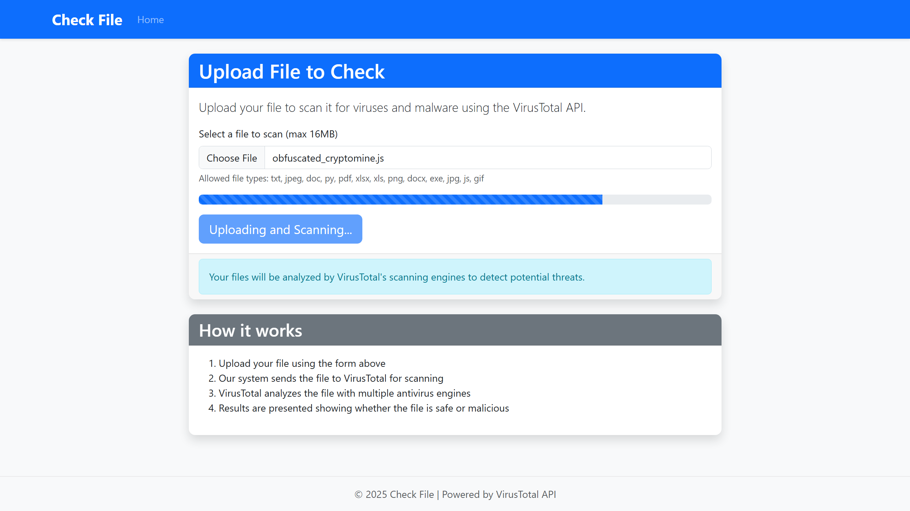
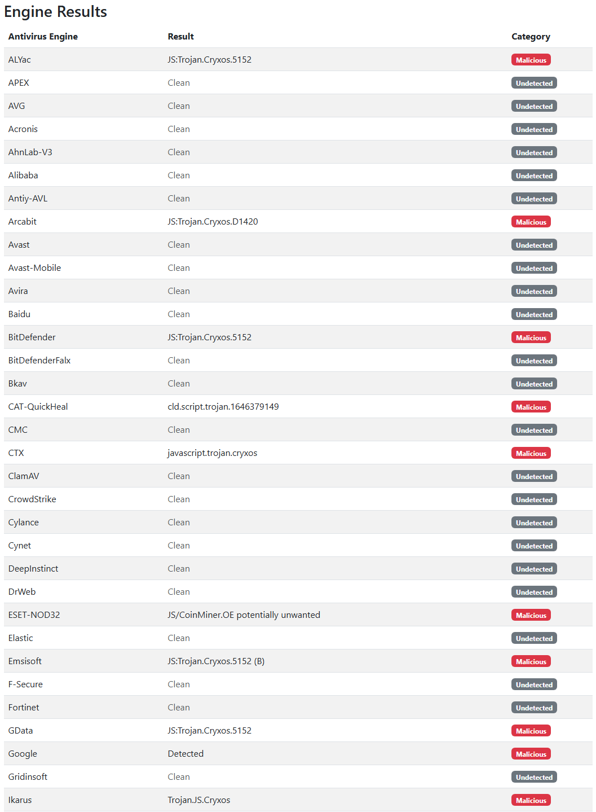

# CheckFile (VirusTotal File Scanner)

A Flask-based web application that allows users to upload files and scan them using the VirusTotal API.
Test the site here! [CheckFile](http://54.252.237.68)
<div align="center">

</div>
<div align="center">

</div>

## 🌟 Features

- **File Upload Interface:** Simple and intuitive web interface for uploading files.
- **VirusTotal API Integration:** Scans uploaded files for malware and viruses.
- **Dynamic Results Display:** Clear presentation of scan results (sorted alphabetically by antivirus engine).
- **Security Measures:** File validation, size limits, CSRF protection, and secure file handling.
- **Responsive Design:** Works seamlessly on both desktop and mobile devices.

## ⚙️ Languages/Platforms

<p align="center">
    
</p>

## 🛠️ Prerequisites

- Python 3.8 or higher
- AWS EC2 instance (or any other hosting service)
- VirusTotal API key

## 📁 Project Structure

```
CheckFile/
│
├── app.py                 # Main Flask application
├── wsgi.py                # Entry point for production (Gunicorn/Waitress)
├── config.py              # Configuration file
├── CheckFile.conf         # Nginx configuration for the Flask app
├── CheckFile.service      # systemd service file for managing the app
├── .env.example           # Example environment variables file
├── templates/             # HTML templates
│   ├── index.html         # File upload form
│   ├── results.html       # Scan results page
│   ├── base.html          # Base template
│   └── error.html         # Error page
├── static/                # Static assets
│   ├── css/
│   │   └── style.css      # Custom styles
│   └── js/
│       └── main.js        # JavaScript for dynamic features
├── requirements.txt       # Dependencies
└── README.md              # Documentation
```

## 🚀 Installation and Setup

### Local Development

1. **Clone the repository:**
   ```bash
   git clone https://github.com/lolkabash/CheckFile.git
   cd CheckFile
   ```

2. **Set up a virtual environment and install dependencies:**

   **Linux/macOS:**
   ```bash
   python3 -m venv venv
   source venv/bin/activate
   pip install -r requirements.txt
   ```

   **Windows:**
   ```bash
   python -m venv venv
   venv\Scripts\activate
   pip install -r requirements.txt
   ```

3. **Set up environment variables:**

   **Linux/macOS:**
   ```bash
   export VIRUSTOTAL_API_KEY='your_api_key_here'
   export SECRET_KEY='your_secret_key_here'
   export DEBUG='True'
   ```

   **Windows:**
   ```bash
   set VIRUSTOTAL_API_KEY=your_api_key_here
   set SECRET_KEY=your_secret_key_here
   set DEBUG=True
   ```

   Alternatively, use a `.env` file:
   ```bash
   cp .env.example .env
   # Edit the .env file with your own values
   ```

4. **Run the development server:**

   **Linux/macOS:**
   ```bash
   gunicorn --bind 0.0.0.0:5000 wsgi:app
   ```

   **Windows:**
   ```bash
   waitress-serve --listen=*:5000 wsgi:app
   ```

   For quick debugging:
   ```bash
   python app.py
   ```

5. **Access the application:**  
   Open your browser and navigate to [http://localhost:5000](http://localhost:5000).

## ☁️ Production Deployment on AWS EC2

### 1. Instance Setup

1. Launch an EC2 instance:
   - Choose **Amazon Linux 2** or **Ubuntu Server**.
   - Select **t2.micro** for free tier eligibility.
   - Configure the security group to allow SSH (22), HTTP (80), and HTTPS (443).

2. Connect to your EC2 instance:
   ```bash
   ssh -i your-key.pem ec2-user@your-instance-public-ip
   ```

---

### 2. Application Setup

1. **Update system packages:**
   ```bash
   sudo yum update -y  # For Amazon Linux
   # OR
   sudo apt update && sudo apt upgrade -y  # For Ubuntu
   ```

2. **Install required packages:**
   ```bash
   sudo yum install python3 python3-pip git nginx -y  # For Amazon Linux
   # OR
   sudo apt install python3 python3-pip git nginx -y  # For Ubuntu
   ```

3. **Clone the repository:**
   ```bash
   git clone https://github.com/lolkabash/CheckFile.git
   cd CheckFile
   ```

4. **Set up the environment:**
   ```bash
   python3 -m venv venv
   source venv/bin/activate
   pip install -r requirements.txt
   
   cp .env.example .env
   # Edit the .env file with your production values
   nano .env
   ```

---

### 3. Web Server Configuration

1. **Set up Nginx:**
   ```bash
   sudo cp CheckFile.conf /etc/nginx/conf.d/
   # Edit the configuration to match your domain or IP
   sudo nano /etc/nginx/conf.d/CheckFile.conf
   
   # Test and restart Nginx
   sudo nginx -t
   sudo systemctl restart nginx
   ```

2. **Configure systemd for the application:**
   ```bash
   sudo cp CheckFile.service /etc/systemd/system/
   sudo systemctl daemon-reload
   sudo systemctl start CheckFile
   sudo systemctl enable CheckFile
   ```

3. **Check the application status:**
   ```bash
   sudo systemctl status CheckFile
   ```

---

### 4. Secure Your Site (Optional)

1. **Set up SSL with Let's Encrypt:**
   ```bash
   sudo amazon-linux-extras install epel -y  # For Amazon Linux
   sudo yum install certbot python3-certbot-nginx -y
   # OR
   sudo apt install certbot python3-certbot-nginx -y  # For Ubuntu
   
   sudo certbot --nginx -d yourdomain.com
   ```

## 🛡️ Security Considerations

### Nginx Security Features

The Nginx configuration (`CheckFile.conf`) includes additional security headers to protect the application:

- **`X-Content-Type-Options: nosniff`:** Prevents browsers from interpreting files as a different MIME type, enhancing security against attacks like MIME type confusion.
- **`X-Frame-Options: SAMEORIGIN`:** Prevents the website from being embedded in an iframe, mitigating clickjacking attacks.
- **`X-XSS-Protection: 1; mode=block`:** Enables the browser's built-in Cross-Site Scripting (XSS) filter to block detected attacks.
- **`Referrer-Policy: strict-origin-when-cross-origin`:** Ensures that the referrer header is sent only for same-origin requests, protecting sensitive data in URL referrers.
- **`Content-Security-Policy (CSP)`:** Restricts the sources of scripts, styles, and other resources to trusted domains, reducing the risk of XSS attacks. The CSP in the configuration allows:
  - Scripts and styles from the application's domain and trusted CDNs like `cdn.jsdelivr.net`.
  - Fonts from trusted sources such as `cdn.jsdelivr.net` and `fontawesome.com`.
  - Images from `https` sources and inline `data` URIs.

These headers significantly improve the application's resilience against common web vulnerabilities.

### Other Security Considerations

- **File Validation:** Restricts file types and sizes during upload.
- **Temporary Storage:** Uploaded files are deleted after scanning.
- **Environment Variables:** Sensitive data like API keys are stored securely.
- **Sanitized Input:** Prevents malicious execution.
- **CSRF Protection:** All forms are protected against cross-site request forgery.

## 🛠️ Customization

- **Theme:** Modify `static/css/style.css` to customize the design.
- **File Validations:** Extend file validation logic in the `upload_file` route.
- **Results Display:** Add more details from VirusTotal API to the results page.

## 🔧 Troubleshooting

- **Application Fails to Start:** Check system logs:
  ```bash
  sudo journalctl -u CheckFile.service
  ```

- **API Key Errors:** Ensure the VirusTotal API key is correctly set.

- **File Upload Issues:** Verify file size limits (16MB by default).

## 💡 Setup Process, Challenges, and Solutions

<div align="center">

### My Journey from Vision to Implementation

</div>

Building **CheckFile** required careful planning, technical expertise, and iterative problem-solving. Below is a breakdown of the setup process, the challenges I encountered, and the solutions I implemented to overcome them.

---

### Initial Setup 🛠️

1. **Hosting Environment:**  
   I chose **AWS EC2** as the hosting environment for its scalability, flexibility, and cost-effectiveness. The instance was configured with **Amazon Linux 2**, a lightweight and efficient operating system tailored for AWS.

2. **Flask Application Deployment:**  
   Given my experience with locally hosted websites using Flask, I decided to stick with this framework for its simplicity and familiarity. The Flask application was containerized using virtual environments to ensure isolated dependencies. The Gunicorn WSGI server was integrated for production deployment to handle concurrent requests efficiently.

3. **Webserver Configuration with Nginx:**  
   Nginx was set up as a reverse proxy to forward incoming traffic to the Flask application running on `127.0.0.1:5000`. Security headers were added to protect the application from common threats like XSS and clickjacking.

4. **VirusTotal API Integration:**  
   The VirusTotal API was integrated to scan files uploaded by users. API keys were securely stored in environment variables to protect sensitive information.

---

### Challenges Encountered and Solutions 🔄

#### **1. Limited Experience with EC2 Hosting**
   - **Challenge:** This was my first time deploying an application to a cloud platform like AWS EC2, and I was unfamiliar with the nuances of managing an instance.
   - **Solution:** I spent several hours researching, Googling, and watching YouTube tutorials to understand the process of setting up EC2, configuring security groups, and deploying the application. This hands-on learning approach helped me overcome my lack of experience.

#### **2. Configuring Nginx for Security and Performance**
   - **Challenge:** Setting up Nginx with proper security headers and ensuring it efficiently handled traffic to the Flask backend.
   - **Solution:** I included the following security headers in the Nginx configuration:
     - `X-Content-Type-Options: nosniff` to prevent MIME-type attacks.
     - `X-Frame-Options: SAMEORIGIN` to mitigate clickjacking.
     - `X-XSS-Protection: 1; mode=block` to enable browser-based XSS filtering.
     - `Content-Security-Policy` to restrict resource loading to trusted sources.
     - `Referrer-Policy: strict-origin-when-cross-origin` to limit sensitive data leakage in referrers.

#### **3. Managing File Uploads**
   - **Challenge:** Limiting file size and validating file types to prevent abuse and ensure compatibility with the VirusTotal API.
   - **Solution:** Implemented validation logic in the `upload_file` route to restrict file size to 16MB (the API's limit) and allow only specific file types (`txt`, `pdf`, `jpg`, `exe`, etc.). Uploaded files are stored temporarily and deleted immediately after scanning.

#### **4. Debugging Nginx and EC2 Hosting Issues**
   - **Challenge:** Nginx configuration errors and EC2-specific networking issues caused the website to be inaccessible externally despite being hosted locally on the instance.
   - **Solution:** This required extensive troubleshooting, involving error log analysis and configuration adjustments. I referred to online resources, including Stack Overflow and YouTube tutorials, to identify and resolve issues like incorrect `server_name` values and missing security group rules. The initial guide I was referring to was based around the Ubuntu version of EC2 and differed in nginx configuration path. In the Ubuntu version the `.config` file should be placed in `/etc/nginx/sites-available/default` but for Amazon Linux it should instead be in `/etc/nginx/conf.d/*.conf`.

#### **5. Environment Variable Management**
   - **Challenge:** Securely managing sensitive data such as the VirusTotal API key and Flask's secret key.
   - **Solution:** Leveraged `.env` files and Python's `os.environ` for secure variable access. An example `.env.example` file was provided for easy configuration while keeping sensitive values out of version control.

#### **6. HTTPS Configuration**
   - **Challenge:** Running the application over HTTP initially left it vulnerable to man-in-the-middle attacks.
   - **Solution:** Set up SSL using **Let's Encrypt**, automating certificate retrieval and renewal. Though initially configured for demonstration purposes, the solution provides a pathway for production-level HTTPS security.

---

### Lessons Learned and Future Improvements 🎯

1. **Familiarity with Cloud Hosting:**  
   This project gave me a deeper understanding of cloud deployment and AWS EC2. While initially overwhelming, the experience was incredibly rewarding and has prepared me for future projects.

2. **Automation:**  
   The deployment process could benefit from a CI/CD pipeline using GitHub Actions to automate testing and deployment.

3. **Enhanced Monitoring:**  
   Tools like Prometheus and Grafana could be integrated to monitor application performance and resource usage in real time.

4. **Load Balancing and Auto-scaling:**  
   Expanding the architecture to include an AWS Application Load Balancer and auto-scaling groups to handle traffic spikes dynamically.

5. **Improved Environment Security:**  
   Securely managing environment variables and secrets is critical for maintaining application security in production environments. Future iterations could use tools like **AWS Secrets Manager** or **HashiCorp Vault** to securely manage sensitive information, such as API keys and secret keys, instead of relying solely on `.env` files.

6. **Expanded Security Practices:**  
   While the application includes basic security features, future iterations could implement:
   - Rate limiting to prevent abuse.
   - Web Application Firewall (WAF) for enhanced protection against attacks.

---

<div align="center">

### Closing Thoughts 💭

</div>

The process of building **CheckFile** was both challenging and rewarding. Starting from my comfort zone of locally hosted Flask applications, I ventured into cloud hosting on AWS EC2, gaining valuable insights and skills along the way. Limited by time, I had only 2 days to complete the project, which meant I had to prioritize the core functionality over future enhancements. 

Despite this constraint, it was an incredibly fulfilling experience, and I’m glad I took on the challenge despite the seemingly hard learning curve. Given more time, I would implement all the future considerations, such as CI/CD pipelines, advanced monitoring, and improved environment security. This project has solidified my confidence in tackling more complex, cloud-deployed systems in the future, and I look forward to applying these lessons to bigger and better projects.

## 📃 License

This project is licensed under the [MIT License](LICENSE).

## 📚 Resources

- [Deploying a Flask Application on EC2](https://aws.plainenglish.io/deploying-a-flask-application-on-ec2-54cfeb396fa1)
- [Nginx Missing `sites-available` Directory](https://betterstack.com/community/questions/nginx-missing-site-available-directory/):  
- [Install Nginx on Amazon EC2 in 5 Minutes](https://medium.com/@nathan_149/install-nginx-on-amazon-ec2-in-5-minutes-get-a-web-server-up-and-running-3516fd06b76)
- [Protecting Your AWS Environment: The Risks of Exposed `.env` Files and Stolen API Keys](https://medium.com/@ahmadbilalch891/protecting-your-aws-environment-understanding-the-risks-of-exposed-env-files-and-stolen-api-keys-1ebda9b7ed5d)
- [Waitress Documentation](https://docs.pylonsproject.org/projects/waitress/en/latest/)
- [YouTube: Deploying a Flask App on AWS EC2](https://www.youtube.com/watch?v=nrDv_5QWYFs)

## 📷 Screenshots
<div align="center">




</div>